# System Architecture & Technical Flowcharts: Upemba IoT

This document provides the complete collection of formal system architecture diagrams, sequence diagrams, entity-relationship models, and decision flowcharts for the **Upemba IoT Predictive Maintenance System**. All diagrams are structured in vertical layout (`TD` / top-to-bottom) for optimal rendering in academic reports, technical documentation, and book publications.

---

## Figure 1 — High-Level System Architecture

```mermaid
flowchart TD
    subgraph L1 ["1. Physical / Field Layer"]
        SOLAR["Solar Inverter Systems"]
        PUMP["Water Pumps & Electric Motors"]
        SERVER["Off-Grid Server Infrastructure"]
    end

    subgraph L2 ["2. IoT Sensing Layer (ESP32)"]
        SENS["MPU-6050 Accelerometer & Gyroscope\nVoltage Transducers & Temperature Probes"]
        ESP["ESP32-WROOM-32 Microcontroller\n(Dual Core LX6, 240MHz, 802.11 b/g/n)"]
        SENS -->|I2C: GPIO 21/22 & ADC| ESP
    end

    SOLAR -. Physical Vibration & Heat .-> SENS
    PUMP -. Physical Vibration & Heat .-> SENS
    SERVER -. Thermal & Voltage Drift .-> SENS

    subgraph L3 ["3. Network & Transport Layer"]
        WIFI["Local Wi-Fi Access Point (192.168.1.0/24)"]
        MQTT_PUB["MQTT Publisher Client (TCP Port 1883)"]
        ESP --> WIFI --> MQTT_PUB
    end

    subgraph L4 ["4. Edge Gateway Layer (Raspberry Pi 4B)"]
        MOSQ["Mosquitto MQTT Broker\nTopic: `upemba/sensors/+/telemetry`"]
        LISTENER["Django MQTT Ingestion Daemon\n`python manage.py mqtt_listener`"]
        Q_WORKER["Django Q2 Asynchronous Worker\n`python manage.py qcluster`"]
        DAPHNE["Daphne ASGI Web & WebSocket Server\n(HTTP/1.1 & WSS on Port 8000)"]
        
        MQTT_PUB --> MOSQ
        MOSQ --> LISTENER
    end

    subgraph L5 ["5. Data & Analytics Layer"]
        DB[(SQLite 3 Database: `db.sqlite3`)]
        CHAN["InMemoryChannelLayer (Channels)"]
        ML_ISO["Layer 1: Isolation Forest (scikit-learn)"]
        ML_HOLT["Layer 2: Holt's Linear Trend Forecaster"]
        ALERT_SVC["Alert Service (SMTP Dispatcher)"]

        LISTENER -->|Persist SensorReading| DB
        LISTENER -->|Broadcast `telemetry_reading`| CHAN
        Q_WORKER -->|Read Rolling W=40 Readings| DB
        Q_WORKER --> ML_ISO
        Q_WORKER --> ML_HOLT
        ML_ISO & ML_HOLT -->|Persist HealthStatus| DB
        Q_WORKER -->|Critical Anomaly Detected| ALERT_SVC
        Q_WORKER -->|Broadcast `health_update`| CHAN
    end

    subgraph L6 ["6. Presentation Layer (Client Terminals)"]
        NEXT["Next.js 16 SPA (React 19 / TypeScript)\nTanStack Query + Tailwind CSS + Recharts"]
        UI_3D["3D Isometric Chassis Deflection Engine"]
        UI_PRED["Predictive Trend & Horizon Visualizer"]
        
        DAPHNE <-->|REST API JSON| NEXT
        CHAN -->|WebSocket Push Events| NEXT
        NEXT --> UI_3D
        NEXT --> UI_PRED
    end

    subgraph L7 ["7. Human / Operational Layer"]
        RANGERS["Park Rangers (Field Operations)"]
        TECHS["Field Technicians & Engineers"]
        
        ALERT_SVC -->|SMTP Email Alert (Port 25/587)| TECHS
        NEXT -. Interactive Diagnostics & Logs .-> RANGERS
        NEXT -. Preventive Intervention Schedule .-> TECHS
    end
```

<div align="center">

### **Figure 1. High-Level Architecture of the Upemba IoT Predictive Maintenance System**

</div>

---

## Figure 2 — Physical and IoT Sensing Architecture

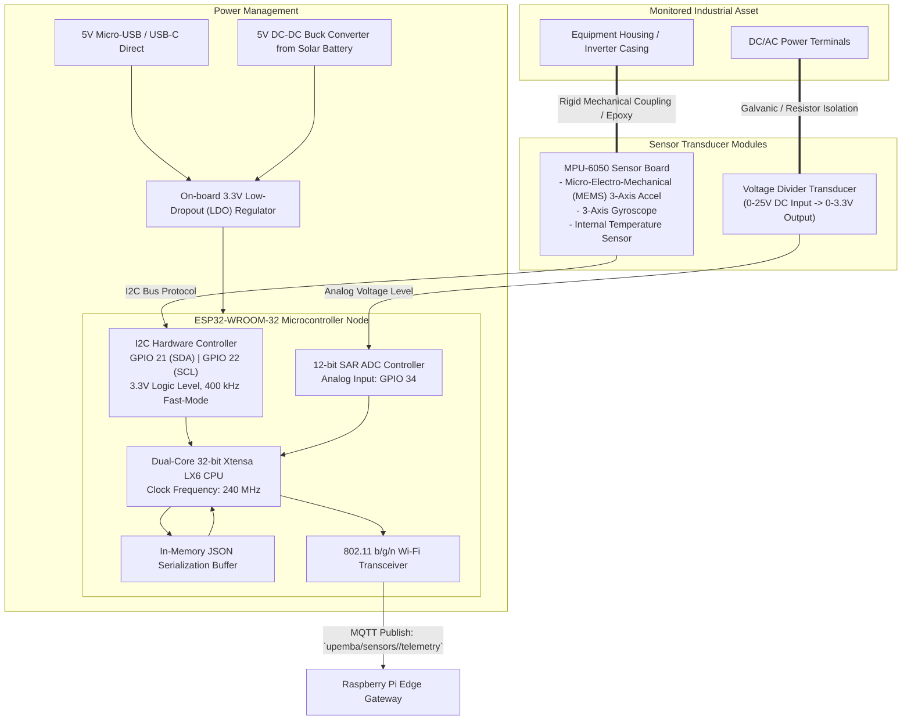

<div align="center">

### **Figure 2. Physical Sensing and IoT Device Architecture**

</div>

---

## Figure 3 — Edge Gateway Architecture

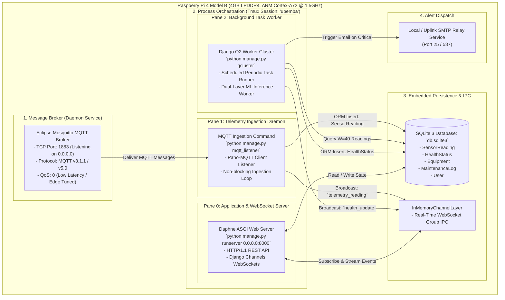

<div align="center">

### **Figure 3. Raspberry Pi Edge Gateway Architecture**

</div>

---

## Figure 4 — MQTT-Based Telemetry Communication Architecture

```mermaid
flowchart TD
    subgraph Publishers ["MQTT Publishers (Field Sensor Nodes)"]
        NODE1["ESP32 Node 1\n`device_id: EQUIP-INV-001`\nTopic: `upemba/sensors/EQUIP-INV-001/telemetry`"]
        NODE2["ESP32 Node 2\n`device_id: EQUIP-MOT-002`\nTopic: `upemba/sensors/EQUIP-MOT-002/telemetry`"]
        NODEN["ESP32 Node N\n`device_id: EQUIP-SRV-003`\nTopic: `upemba/sensors/EQUIP-SRV-003/telemetry`"]
    end

    subgraph BrokerCore ["Mosquitto MQTT Broker (TCP Port 1883)"]
        TOPIC_ROUTER{"Topic Namespace Router\nMatches against wildcard subscriptions"}
    end

    NODE1 -->|Publish Payload (QoS 0)| TOPIC_ROUTER
    NODE2 -->|Publish Payload (QoS 0)| TOPIC_ROUTER
    NODEN -->|Publish Payload (QoS 0)| TOPIC_ROUTER

    subgraph SubscriberBackend ["MQTT Subscriber (Django Ingestion Engine)"]
        SUB_CLIENT["Paho-MQTT v2 Client (`django_mqtt_listener`)"]
        SUB_TOPIC["Subscription: `upemba/sensors/+/telemetry`\n('+ ' Single-Level Wildcard matches all device IDs)"]
        CALLBACK["`on_message(client, userdata, msg)` Callback Handler"]
        
        SUB_CLIENT --> SUB_TOPIC
        SUB_TOPIC --> CALLBACK
    end

    TOPIC_ROUTER -->|Forward Matching Packets| SUB_CLIENT

    subgraph IngestionPipeline ["Data Ingestion Actions"]
        DECODE["Decode UTF-8 Byte Stream"]
        PARSE_JSON["Parse JSON Structure"]
        VALIDATE["Validate Required Keys:\n[device_id, temp, volt, vib.x, vib.y, vib.z]"]
        GET_OR_CREATE["Get or Auto-Provision `Equipment` in Registry"]
        INSERT_DB["INSERT into `telemetry_sensorreading`"]
        WS_FORWARD["Dispatch `telemetry_reading` to Django Channels"]

        CALLBACK --> DECODE --> PARSE_JSON --> VALIDATE --> GET_OR_CREATE --> INSERT_DB --> WS_FORWARD
    end
```

<div align="center">

### **Figure 4. MQTT-Based Telemetry Communication Architecture**

</div>

---

## Figure 5 — End-to-End Telemetry Data Flow

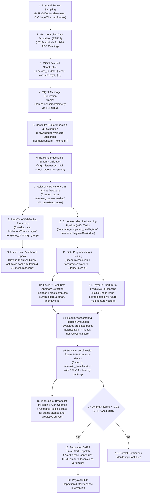

<div align="center">

### **Figure 5. End-to-End Telemetry Data Flow from Sensor Acquisition to Dashboard Visualization**

</div>

---

## Figure 6 — Backend Software Architecture

```mermaid
flowchart TD
    subgraph ConfigLayer ["Master Django Configuration (`config`)"]
        SETTINGS["`settings.py` (Environ injection, Q_CLUSTER, SimpleJWT, Database)"]
        MASTER_URLS["`urls.py` (Route Dispatcher)"]
        API_ROUTER["`api_router.py` (DRF DefaultRouter / SimpleRouter)"]
        ASGI_APP["`asgi.py` (ProtocolTypeRouter: HTTP + WebSockets)"]
    end

    subgraph UsersDomain ["`users` Application Domain"]
        USER_MOD["Model: `User` (AbstractUser + Role: ADMIN / TECHNICIAN / RANGER)"]
        USER_VIEWS["Views: `UserViewSet`, `RegisterView`, `ActivateUserView`, `ResendOTPView`"]
        USER_SERIAL["Serializers: `UserSerializer`, `RegisterSerializer`"]
    end

    subgraph InventoryDomain ["`inventory` Application Domain"]
        EQ_MOD["Model: `Equipment` (UUID PK, Name, Type, MAC Address, Active Flag)"]
        LOG_MOD["Model: `MaintenanceLog` (Equipment FK, Author FK, Description, Action)"]
        INV_VIEWS["Views: `EquipmentViewSet`, `MaintenanceLogViewSet`"]
        INV_SERIAL["Serializers: `EquipmentSerializer`, `MaintenanceLogSerializer`"]
    end

    subgraph TelemetryDomain ["`telemetry` Application Domain"]
        READ_MOD["Model: `SensorReading` (Equipment FK, Temp, Volt, Vib X/Y/Z, Timestamp)"]
        HEALTH_MOD["Model: `HealthStatus` (Current & Predictive Scores, Horizon JSON, Latency, CPU/RAM)"]
        TEL_VIEWS["Views: `HealthStatusViewSet`, `SensorReadingViewSet`"]
        TEL_SERIAL["Serializers: `HealthStatusSerializer`, `SensorReadingSerializer`"]
        WS_CONSUMER["Consumer: `TelemetryConsumer` (AsyncJsonWebsocketConsumer)"]
        
        subgraph TelemetryServices ["Domain Services & Workers"]
            TASK_EVAL["Task: `evaluate_equipment_health_task()`"]
            CMD_MQTT["Command: `mqtt_listener.py`"]
            SVC_ML["Service: `AnomalyDetector` (Isolation Forest)"]
            SVC_PRED["Service: `SensorForecaster` (Holt's Linear Trend)"]
            SVC_ALERT["Service: `AlertService` (SMTP Dispatcher)"]
        end
    end

    ASGI_APP --> MASTER_URLS
    ASGI_APP --> WS_CONSUMER
    MASTER_URLS --> API_ROUTER
    
    API_ROUTER --> USER_VIEWS
    API_ROUTER --> INV_VIEWS
    API_ROUTER --> TEL_VIEWS

    USER_VIEWS --> USER_SERIAL --> USER_MOD
    INV_VIEWS --> INV_SERIAL --> EQ_MOD & LOG_MOD
    TEL_VIEWS --> TEL_SERIAL --> READ_MOD & HEALTH_MOD

    CMD_MQTT --> EQ_MOD & READ_MOD
    TASK_EVAL --> READ_MOD & HEALTH_MOD
    TASK_EVAL --> SVC_ML & SVC_PRED & SVC_ALERT
```

<div align="center">

### **Figure 6. Backend Software Architecture of the IoT Monitoring Platform**

</div>

---

## Figure 7 — REST API Communication Architecture

```mermaid
flowchart TD
    subgraph ClientBrowser ["Next.js Frontend Client (Port 3000)"]
        USER_UI["User Interface Components\n(Dashboard, Predictions, Logs, Equipment, Settings)"]
        QUERY_CACHE["TanStack React Query Cache Layer\n(Keyed Queries: `equipment`, `sensor-readings`, `health-status`)"]
        AXIOS_CLIENT["Axios HTTP Client (`src/lib/api/`)"]
        AUTH_STORE["JWT Cookie Storage (`js-cookie`)"]

        USER_UI <--> QUERY_CACHE
        QUERY_CACHE <--> AXIOS_CLIENT
        AUTH_STORE -->|Inject `Authorization: Bearer <token>`| AXIOS_CLIENT
    end

    subgraph APIRoutes ["Django REST Framework API Gateway (Port 8000)"]
        
        subgraph AuthEndpoints ["Authentication & Account Endpoints"]
            EP_TOKEN["`POST /api/token/` (Obtain Access & Refresh JWT)"]
            EP_REFRESH["`POST /api/token/refresh/` (Rotate Access Token)"]
            EP_REG["`POST /api/register/` (Create User Account)"]
            EP_ACT["`POST /api/activate/` (Verify Email OTP)"]
            EP_RESEND["`POST /api/resend-otp/` (Generate Fresh OTP)"]
            EP_ME["`GET / PATCH /api/users/me/` (Profile Management)"]
            EP_PW["`POST /api/users/change-password/` (Password Update)"]
        end

        subgraph CoreDomainEndpoints ["Domain Resource Endpoints"]
            EP_EQUIP["`GET / POST /api/equipment/` (Equipment Registry & Search)"]
            EP_READINGS["`GET /api/sensor-readings/` (Filtered Telemetry Time-Series)"]
            EP_HEALTH["`GET /api/health-status/` (Current Health & Predictive Horizon)"]
            EP_LOGS["`GET / POST /api/maintenance-logs/` (Maintenance Logbook)"]
        end

        subgraph DocsEndpoints ["Documentation Endpoints"]
            EP_SCHEMA["`GET /api/schema/` (OpenAPI 3.0 YAML/JSON)"]
            EP_SWAGGER["`GET /api/docs/` (Interactive Swagger UI)"]
        end
    end

    subgraph DatabaseLayer ["Relational Persistence"]
        DB[(SQLite 3 Database: `db.sqlite3`)]
    end

    AXIOS_CLIENT ===|HTTP Request + JWT| AuthEndpoints
    AXIOS_CLIENT ===|HTTP Request + JWT| CoreDomainEndpoints
    AXIOS_CLIENT ===|HTTP Request| DocsEndpoints

    AuthEndpoints <--> DatabaseLayer
    CoreDomainEndpoints <--> DatabaseLayer
```

<div align="center">

### **Figure 7. REST API Communication Architecture**

</div>

---

## Figure 8 — Entity-Relationship (ER) Diagram

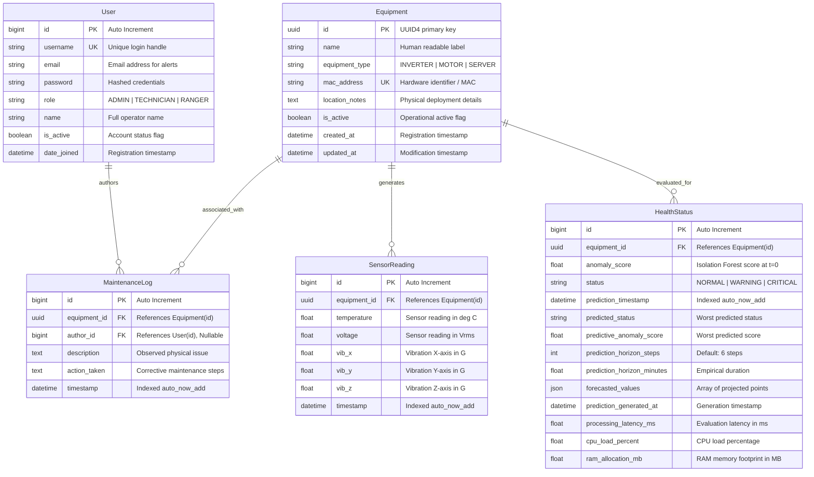

<div align="center">

### **Figure 8. Entity-Relationship Model of the IoT Telemetry Database**

</div>

---

## Figure 9 — Machine Learning Pipeline

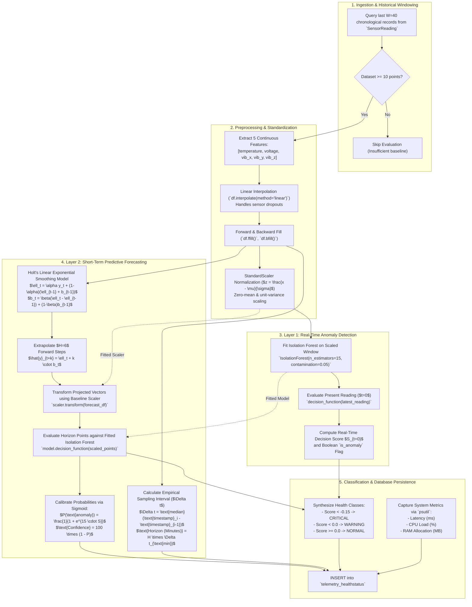

<div align="center">

### **Figure 9. Machine Learning Pipeline for Predictive Maintenance**

</div>

---

## Figure 10 — Predictive Maintenance Decision-Making Flow

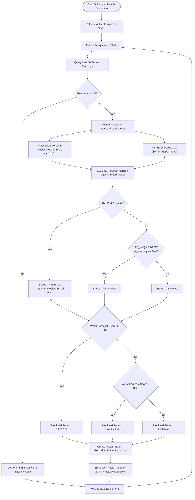

<div align="center">

### **Figure 10. Predictive Maintenance Decision-Making Flow**

</div>

---

## Figure 11 — Alert Generation and Maintenance Response Workflow

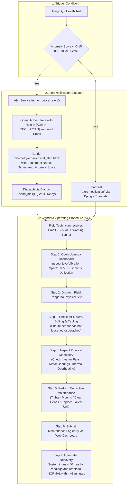

<div align="center">

### **Figure 11. IoT Alert Generation and Maintenance Response Workflow**

</div>

---

## Figure 12 — Real-Time Telemetry Processing Sequence

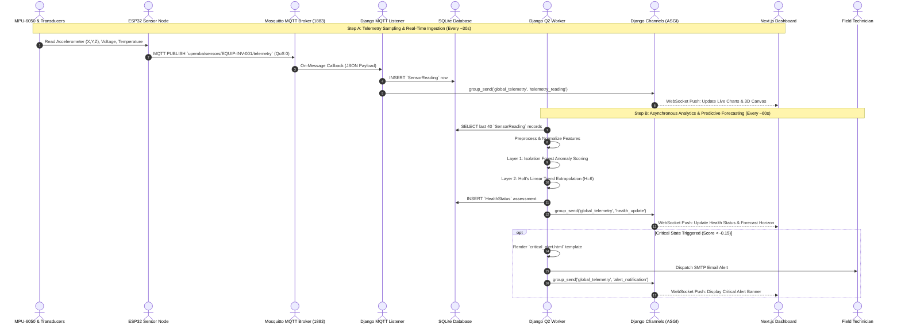

<div align="center">

### **Figure 12. Sequence Diagram of Real-Time IoT Telemetry Processing**

</div>

---

## Figure 13 — Dashboard Data Retrieval Sequence

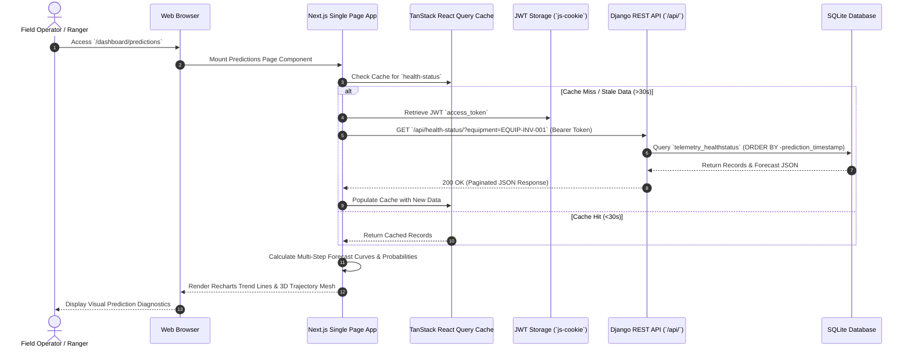

<div align="center">

### **Figure 13. Sequence Diagram for Dashboard Telemetry Retrieval**

</div>

---

## Figure 14 — Deployment Architecture

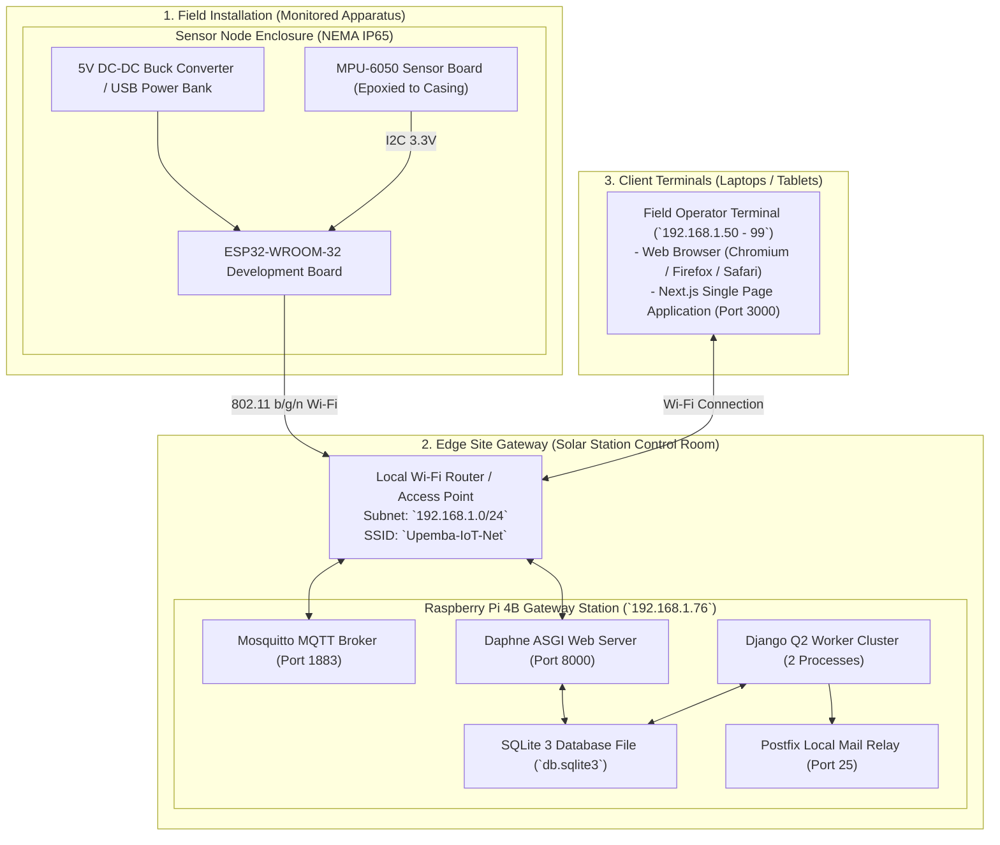

<div align="center">

### **Figure 14. Deployment Architecture of the Upemba IoT System**

</div>

---

## Figure 15 — Network and Communication Architecture

```mermaid
flowchart TD
    subgraph NetworkSegment ["Local Area Network Boundary (192.168.1.0/24)"]
        
        subgraph NodeSubnet ["Sensor Node IP Range (`192.168.1.100 - 150`)"]
            ESP_NODES["ESP32 Microcontrollers\n- Static / DHCP IP Allocation\n- Port: Outbound TCP"]
        end

        subgraph GatewaySubnet ["Edge Gateway Node (`192.168.1.76`)"]
            GATEWAY_HOST["Raspberry Pi 4B\n- MQTT Ingestion Port: 1883\n- HTTP/REST API Port: 8000\n- WebSocket (WSS/WS) Port: 8000\n- SMTP Relay Port: 25 / 587"]
        end

        subgraph ClientSubnet ["Operator Terminal Range (`192.168.1.50 - 99`)"]
            CLIENT_HOSTS["Field Tablets, Laptops, Mobile Terminals\n- Outbound HTTP to Port 8000\n- Outbound WS to Port 8000\n- Next.js Web Server Port 3000"]
        end
    end

    ESP_NODES ===|MQTT over TCP (Port 1883)| GATEWAY_HOST
    CLIENT_HOSTS ===|HTTP/1.1 REST API (Port 8000)| GATEWAY_HOST
    CLIENT_HOSTS ===|Full-Duplex WebSocket (Port 8000)| GATEWAY_HOST
    GATEWAY_HOST ===|SMTP Email Notifications (Port 25/587)| CLIENT_HOSTS
```

<div align="center">

### **Figure 15. Network Communication Architecture of the IoT Infrastructure**

</div>

---

## Figure 16 — Security Architecture

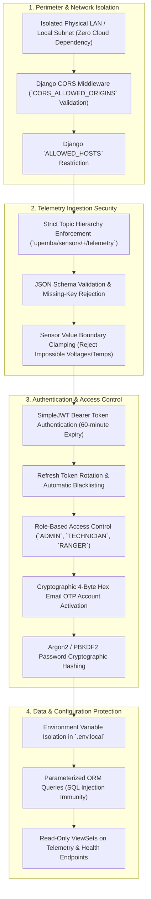

<div align="center">

### **Figure 16. Security Architecture of the IoT Predictive Maintenance Platform**

</div>

---

## Figure 17 — Fault Detection, Handling, and Recovery Flow

```mermaid
flowchart TD
    START_MONITOR(["Continuous Fault Detection Active"]) --> DETECT{"Identify Fault Event"}

    DETECT -- "Wi-Fi Packet Dropout / Incomplete Stream" --> FAULT_1["Fault 1: Missing Sensor Reading"]
    DETECT -- "Corrupted / Non-JSON MQTT Byte Stream" --> FAULT_2["Fault 2: Malformed Payload"]
    DETECT -- "Sensor Detachment / Loose MPU-6050" --> FAULT_3["Fault 3: Physical Transducer Error"]
    DETECT -- "Database Empty / Insufficient Records (<10)" --> FAULT_4["Fault 4: Insufficient Baseline"]
    DETECT -- "SMTP Server Unreachable / Mail Down" --> FAULT_5["Fault 5: Email Dispatch Failure"]
    DETECT -- "Client Browser Disconnects from WebSocket" --> FAULT_6["Fault 6: WebSocket Link Drop"]

    FAULT_1 --> REC_1["Pandas Linear Interpolation + Forward/Backward Fill Imputation in ML Engine"]
    FAULT_2 --> REC_2["`json.JSONDecodeError` Caught Gracefully in Exception Block; Listener Continues Running"]
    FAULT_3 --> REC_3["Isolation Forest Flags Anomaly; Technician SOP Identifies Detached Sensor Module"]
    FAULT_4 --> REC_4["ML Evaluation Skips Gracefully with Informational Log until 10 Readings Accumulate"]
    FAULT_5 --> REC_5["SMTP Exception Caught; Dev OTP/Alert Output to Console; Background Task Survives"]
    FAULT_6 --> REC_6["Frontend Exponential Backoff Auto-Reconnect Loop (1s, 2s, 4s, max 10s)"]

    REC_1 --> RECOVERED(["System Remains Healthy & Operational"])
    REC_2 --> RECOVERED
    REC_3 --> RECOVERED
    REC_4 --> RECOVERED
    REC_5 --> RECOVERED
    REC_6 --> RECOVERED
```

<div align="center">

### **Figure 17. Fault Detection, Handling, and Recovery Flow**

</div>

---

## Figure 18 — System Operational Lifecycle

```mermaid
stateDiagram-v2
    [*] --> NodeBoot: Power Applied to Hardware
    
    state NodeBoot {
        [*] --> HardwareInit: Initialize I2C Bus & ADC GPIO
        HardwareInit --> Wi-FiConnect: Connect to Local Wi-Fi AP
        Wi-FiConnect --> BrokerConnect: Connect to Mosquitto Port 1883
    }

    NodeBoot --> IngestionActive: Broker Handshake Success

    state IngestionActive {
        [*] --> SampleSensors: Read MPU-6050 & Transducers
        SampleSensors --> BuildJSON: Format Telemetry Payload
        BuildJSON --> MQTTPublish: Publish QoS 0 Message
        MQTTPublish --> SleepCycle: Sleep 30 Seconds
        SleepCycle --> SampleSensors
    }

    state EdgeProcessing {
        [*] --> IngestPacket: Listener Receives Packet
        IngestPacket --> StoreDatabase: Save SensorReading Row
        StoreDatabase --> PushWebSocket: Broadcast to UI Clients
        PushWebSocket --> ScheduledTask: 60s Periodic Task Fires
        
        state ScheduledTask {
            [*] --> FitIsolationForest: Train on Last 40 Points
            FitIsolationForest --> HoltForecasting: Project +6 Horizon Steps
            HoltForecasting --> AssessHealthState: Classify Health Status
        }
    }

    IngestionActive --> EdgeProcessing: Telemetry Arrives

    state HealthClassification {
        AssessHealthState --> NormalState: Anomaly Score >= 0.0
        AssessHealthState --> WarningState: Anomaly Score in [-0.15, 0.0)
        AssessHealthState --> CriticalState: Anomaly Score < -0.15
    }

    state OperationalResponse {
        CriticalState --> SendSMTPAlert: Trigger Critical Email
        SendSMTPAlert --> DispatchTech: Dispatch Field Technician
        DispatchTech --> PerformInspection: Check Machinery & Sensor Bolting
        PerformInspection --> MechanicalRepair: Execute Fix
        MechanicalRepair --> BaselineHealing: Machinery Restored to Normal
    }

    BaselineHealing --> NormalState: 40 Clean Readings Ingested
```

<div align="center">

### **Figure 18. Operational Lifecycle of the IoT Predictive Maintenance System**

</div>
