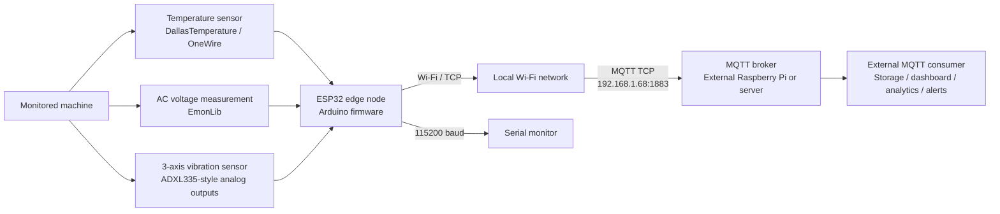
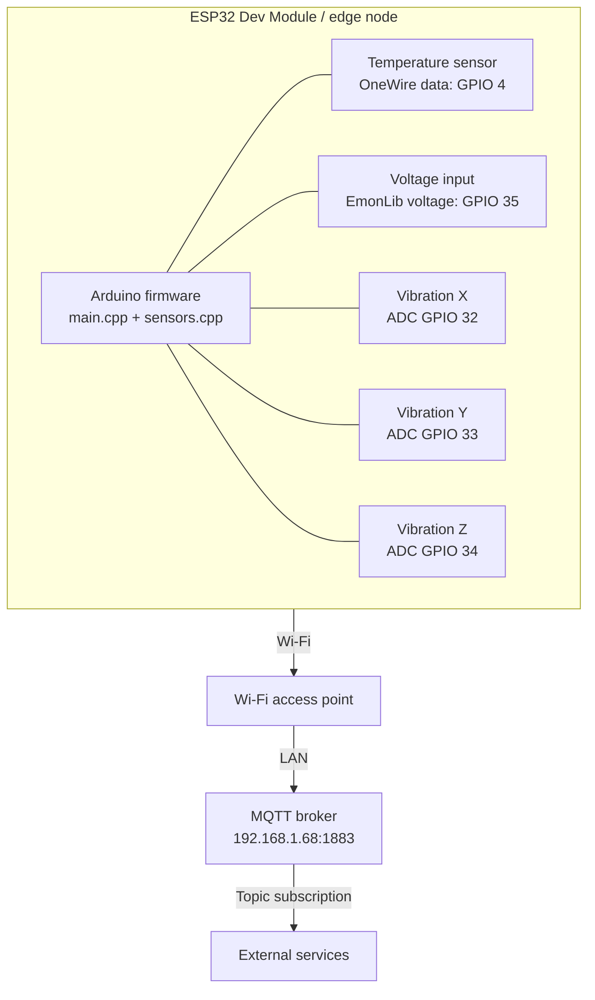
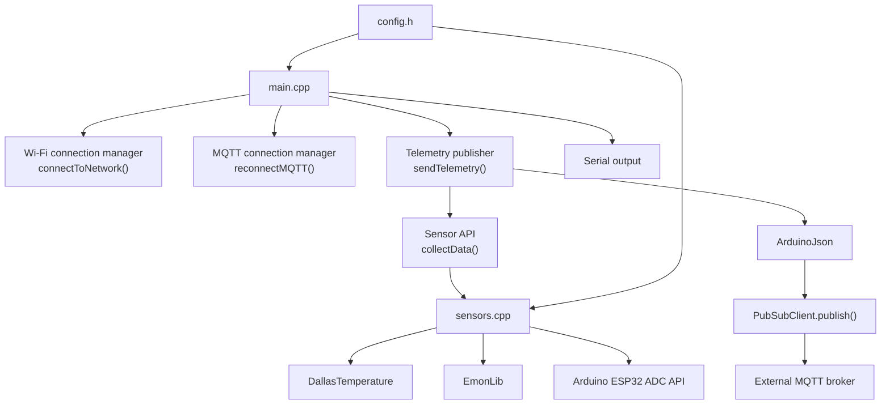
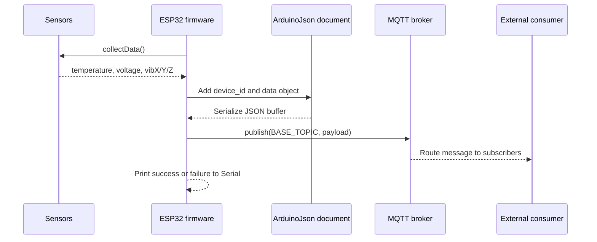
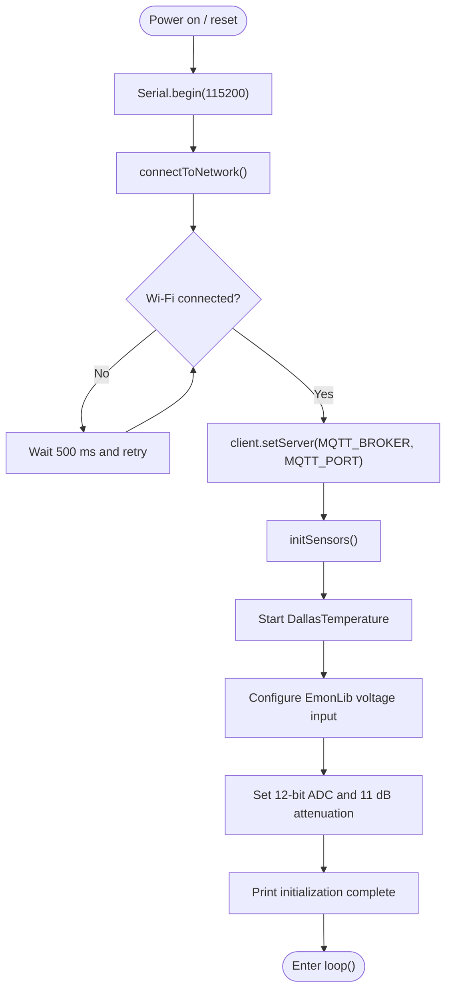
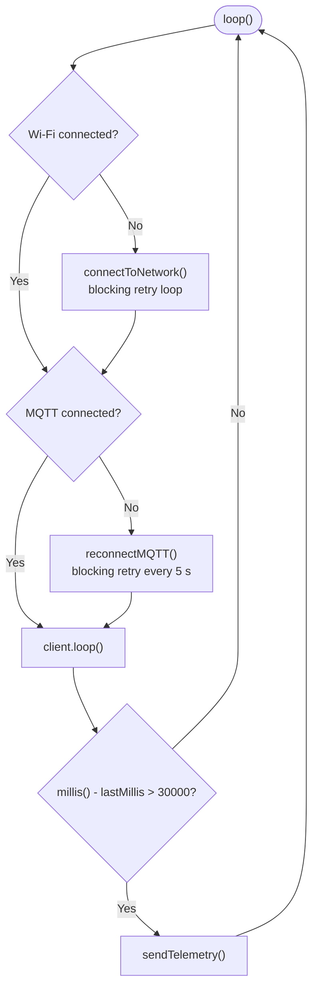
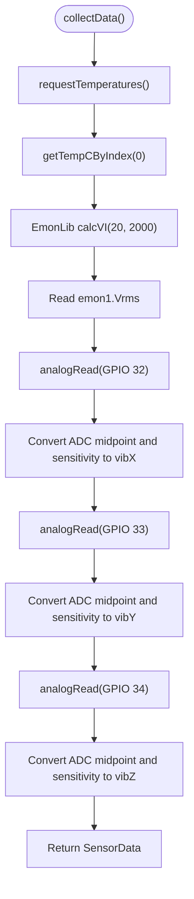
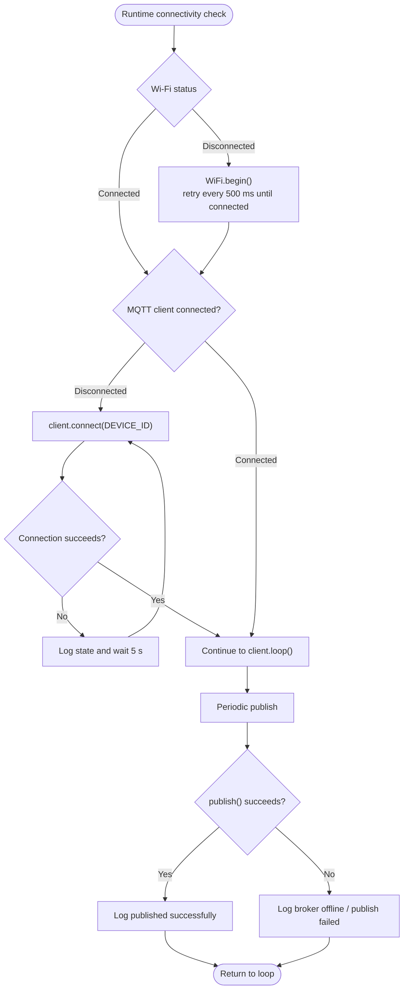
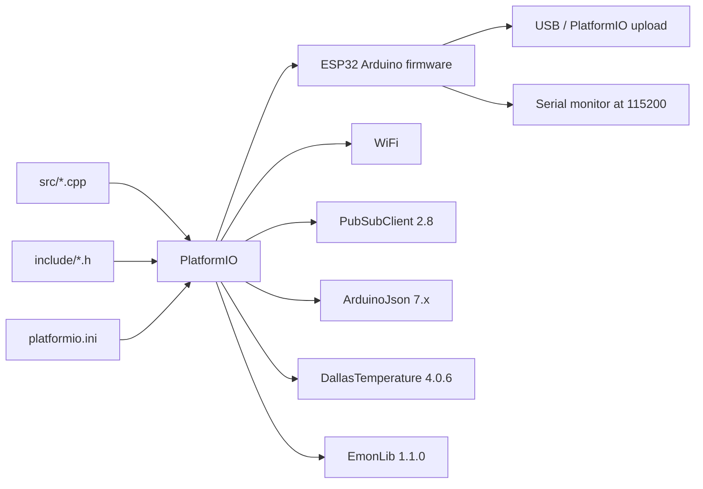
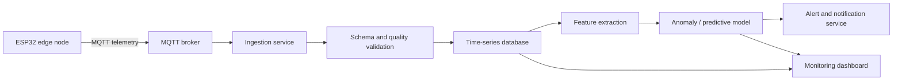

# Predictive Maintenance Firmware Architecture

## 1. Scope and Audit Result

This document describes the architecture implemented by the current repository as audited on 2026-08-26.

The repository contains firmware for one ESP32 edge node. It acquires temperature, AC voltage, and three-axis vibration readings, prints a local preview over Serial, and publishes JSON telemetry over MQTT. The MQTT broker and all downstream predictive-maintenance services are external to this repository.

The current firmware does **not** implement the following downstream functions:

- MQTT broker operation
- telemetry persistence or database storage
- dashboard presentation
- anomaly detection or machine-learning inference
- alert generation
- device authentication or encrypted MQTT transport
- automated unit tests

The project builds successfully with PlatformIO for the `esp32dev` target.

## 2. Repository Structure

```text
platformio.ini       PlatformIO target, framework, monitor speed, dependencies
include/config.h     Network, broker, device identity, topic, and timing constants
include/sensors.h    SensorData contract and sensor API
src/main.cpp         ESP32 lifecycle, connectivity, telemetry serialization, publishing
src/sensors.cpp      Sensor initialization and sensor acquisition/conversion
test/                PlatformIO test location; no project tests are currently present
lib/                 PlatformIO private-library location; no project library is present
```

## 3. System Context

**Figure 1. System context and external data-consumer boundary.**



### Boundary

The firmware owns sensor acquisition, unit conversion, device identity, JSON serialization, connectivity maintenance, and MQTT publication. The broker owns message routing. Any persistence, visualization, prediction, or alerting belongs to an external subscriber and is not represented as implemented code in this repository.

## 4. Hardware and Software Deployment

**Figure 2. Physical and software deployment architecture of the ESP32 edge node.**



### Pin and conversion contract

| Signal | Implementation | Actual configuration |
|---|---|---|
| Temperature | `DallasTemperature` through `OneWire` | OneWire GPIO 4 |
| AC voltage | `EmonLib::EnergyMonitor` | GPIO 35, calibration `167.3`, phase shift `1.7` |
| Current input | Not used by the project | No current sensor is part of the active measurement or telemetry path |
| Vibration X | ESP32 ADC | GPIO 32; 12-bit ADC, 11 dB attenuation |
| Vibration Y | ESP32 ADC | GPIO 33; 12-bit ADC, 11 dB attenuation |
| Vibration Z | ESP32 ADC | GPIO 34; 12-bit ADC, 11 dB attenuation |

The vibration conversion assumes 3.3 V ADC reference behavior, a 12-bit midpoint of `2048`, and approximately `330 mV/g` sensitivity. The resulting values are labeled in the Serial output as G values. Although the source currently contains an `EmonLib` current-channel configuration on GPIO 36, the project does not use a current input: current is not represented in `SensorData`, is not part of the documented hardware interface, and is not published in MQTT telemetry.

## 5. Firmware Component Architecture

**Figure 3. Logical component architecture of the ESP32 telemetry firmware.**



## 6. Configuration and Runtime Parameters

| Parameter | Current value | Purpose |
|---|---|---|
| Wi-Fi SSID | `CANALBOX-F262-2G` | Network to join |
| MQTT broker | `192.168.1.68` | Broker address |
| MQTT port | `1883` | Unencrypted MQTT port |
| Device ID | `EQUIP-INV-001` | MQTT client and payload identity |
| Base topic | `upemba/sensors/EQUIP-INV-001/telemetry` | Telemetry publication topic |
| Report interval | `30000 ms` | Approximately 30-second publication interval |
| Serial monitor | `115200 baud` | Local diagnostic output |

The README currently says telemetry repeats every 5 seconds, but the implemented `REPORT_INTERVAL` is 30 seconds. This architecture document follows the code: the actual interval is 30 seconds.

## 7. Telemetry Data Contract

Each successful `sendTelemetry()` call creates a JSON document with this shape:

```json
{
  "device_id": "EQUIP-INV-001",
  "data": {
    "temp": 25.4,
    "volt": 230.1,
    "vib": {
      "x": 0.02,
      "y": -0.01,
      "z": 1.01
    }
  }
}
```

The values above are illustrative; the firmware publishes the current readings. There is no timestamp, sequence number, quality flag, firmware version, or explicit unit metadata in the payload. Units are implicit: temperature is Celsius, voltage is RMS volts, and vibration values are intended to represent G.

**Figure 4. Sensor-to-MQTT telemetry publication sequence.**



## 8. Startup Flow

**Figure 5. ESP32 firmware startup and sensor-initialization flowchart.**



Wi-Fi connection is blocking during startup: the device does not proceed to sensor initialization until Wi-Fi reports `WL_CONNECTED`.

## 9. Main Runtime Flow

**Figure 6. Main runtime loop and periodic telemetry scheduling flowchart.**



The first telemetry publication normally occurs only after the 30-second timer condition becomes true. The timer is not reset after reconnecting, and failed publishes are logged but not queued for retry.

## 10. Sensor Acquisition Flow

**Figure 7. Sequential sensor acquisition and signal-conversion flowchart.**



The sensor reads are sequential. The implemented measurement path uses temperature, voltage, and vibration only. The current input is not used by this project and does not appear in `SensorData` or the MQTT payload. `EmonLib` performs the voltage calculation internally for 20 half-cycles with a 2000 ms timeout parameter.

## 11. Connectivity and Failure Flow

**Figure 8. Wi-Fi and MQTT connectivity-maintenance and publication-failure flowchart.**



There is no local buffering, exponential backoff, watchdog recovery, or offline persistence. A failed publication is discarded. MQTT is configured on port 1883 without TLS or credentials in the current code.

## 12. Build and Dependency Architecture

**Figure 9. PlatformIO build and firmware dependency architecture.**



## 13. Audit Findings and Recommended Next Steps

### Confirmed implementation facts

- Target is an ESP32 Dev Module using the Arduino framework.
- Telemetry is published to `upemba/sensors/EQUIP-INV-001/telemetry`.
- Publication is configured for approximately every 30 seconds.
- Wi-Fi and MQTT reconnection loops block the main loop until they succeed.
- MQTT uses client ID `EQUIP-INV-001` and no username/password.
- The broker address is a fixed private IPv4 address.
- The repository contains no backend, model, dashboard, persistence, or test implementation.

### Risks and gaps

1. Wi-Fi credentials are stored as plaintext in `include/config.h`; they should be moved to an untracked secrets file or build-time environment variables.
2. MQTT uses unauthenticated, unencrypted port 1883; production deployment needs broker authentication and TLS where practical.
3. There is no payload timestamp, making server-side ordering and time-series analysis dependent on broker receipt time.
4. Sensor errors are not validated. For example, a missing temperature sensor can produce an invalid reading, and ADC values are accepted without range or plausibility checks.
5. Failed MQTT publishes are discarded and there is no offline queue.
6. The README interval statement should be changed from 5 seconds to 30 seconds, or `REPORT_INTERVAL` should be changed if 5 seconds is the intended requirement.
7. `config.h` defines non-`static` global pointer variables in a header. This is currently safe for the single translation-unit usage pattern but should be changed to `constexpr` or `inline constexpr` configuration values as the project grows.
8. The current repository has no automated tests for conversion formulas, JSON shape, timing, reconnection, or sensor failure handling.

## 14. Suggested Production Extension

The intended end-to-end predictive-maintenance architecture would extend the external consumer boundary as follows:

**Figure 10. Proposed extension from MQTT ingestion to predictive-maintenance services.**



This extension is a target architecture, not a claim about functionality currently present in this repository.
